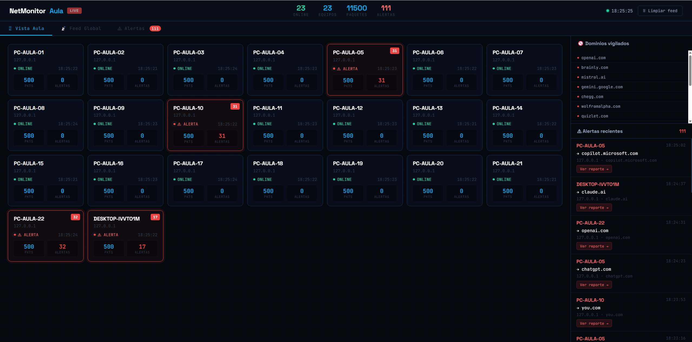

# 🖥 NetMonitor Aula

[](https://python.org)
[](https://scapy.net)
[](LICENSE)
[](https://nebrija.es)

> Sistema distribuido de monitorización de red en tiempo real. Captura tráfico DNS y TCP de múltiples nodos simultáneamente, detecta accesos a servicios configurables (IAs, webs bloqueadas, etc.) y genera reportes automáticos de alerta. Aplicable en aulas, laboratorios, oficinas o cualquier red local.

---

## 📸 Demo


*Dashboard con 23 equipos conectados en tiempo real, alertas detectadas automáticamente*

---

## ✨ Características

- **Monitor distribuido** — N nodos cliente reportan tráfico a un servidor central
- **Packet sniffer real** — captura DNS y TCP con Scapy + Npcap
- **Detección configurable** — alertas cuando un nodo consulta dominios de la lista (`alertas.json`)
- **Despliegue silencioso** — `pythonw.exe` + PsExec, el cliente es invisible para el usuario
- **Geolocalización** — país, ciudad e ISP de cada host monitorizado
- **Reportes HTML automáticos** — generados al instante cuando se detecta una alerta
- **Dashboard en tiempo real** — grid de equipos, feed de paquetes y panel de alertas
- **Simulador** — simula N PCs con tráfico realista para pruebas sin hardware adicional

---

## 🏗 Arquitectura

```
┌─────────────────────────────────────────────────────────┐
│                     RED LOCAL                            │
│                                                          │
│  [Nodo-01] ──┐                                          │
│  [Nodo-02] ──┤                                          │
│     ...      ├──► server.py :9998 ──► Dashboard :8080   │
│  [Nodo-N]  ──┘         │                                │
│                         └──► server/reportes/*.html      │
└─────────────────────────────────────────────────────────┘
```

---

## 📁 Estructura del proyecto

```
netmonitor-aula/
├── server/
│   ├── server.py           ← servidor central (lógica pura)
│   ├── alertas.json        ← dominios vigilados (editable)
│   ├── deploy_aula.bat     ← despliegue silencioso con PsExec
│   ├── PsExec.exe          ← descargar de Microsoft Sysinternals
│   └── front/
│       └── index.html      ← dashboard web (separado del servidor)
├── client/
│   └── client_sniffer.py  ← nodo cliente con Scapy
├── simulador_aula.py       ← simula N equipos para pruebas locales
├── README.md
└── .gitignore
```

> **Nota:** `PsExec.exe` no está incluido en el repo. Descárgalo de [Microsoft Sysinternals](https://learn.microsoft.com/en-us/sysinternals/downloads/psexec) y colócalo en `server/`.

---

## 🚀 Instalación

### Requisitos (equipo servidor)

- Python 3.8+
- Sin dependencias externas adicionales

### Requisitos (equipos cliente)

- Python 3.8+
- [Npcap](https://npcap.com) — driver de captura de paquetes
- Scapy

```bash
pip install scapy
```

---

## 💻 Uso

### Prueba local (un solo equipo, sin hardware adicional)

```bash
# Terminal 1 — Servidor (como Administrador)
cd server
python server.py

# Terminal 2 — Simulador de N equipos (sin Admin)
python simulador_aula.py

# Opcional Terminal 3 — Tu propio equipo como cliente real (como Administrador)
cd client
python client_sniffer.py --servidor 127.0.0.1

# Abrir dashboard
http://localhost:8080
```

### Despliegue real en red local

**1. Preparar el servidor** — compartir la carpeta client por red (una sola vez):

```batch
net share NetMonitor=C:\netmonitor-aula\client /grant:everyone,read
```

**2. Editar `server/deploy_aula.bat`** con la IP del servidor, credenciales y nombres de los equipos.

**3. Ejecutar desde el servidor:**

```batch
cd server

deploy_aula.bat           # Activa monitorización silenciosa en todos los nodos
deploy_aula.bat stop      # Detiene el sniffer en todos los nodos
deploy_aula.bat status    # Comprueba qué nodos están activos
```

El cliente se lanza con `pythonw.exe` — **completamente invisible** para el usuario del equipo remoto.

---

## ⚙️ Configuración

### Dominios vigilados (`server/alertas.json`)

Edita sin tocar código. El servidor lo lee al arrancar:

```json
{
  "dominios_vigilados": [
    "chatgpt.com",
    "claude.ai",
    "gemini.google.com",
    "copilot.microsoft.com"
  ],
  "alertas_extra": [
    "chegg.com",
    "coursehero.com"
  ]
}
```

Cuando cualquier nodo consulta un dominio de la lista:
1. **Alerta inmediata** en el dashboard con animación
2. **Tarjeta del equipo en rojo**
3. **Reporte HTML** generado en `server/reportes/alerta_N.html`

### Parámetros del simulador

```bash
python simulador_aula.py --n 10           # 10 equipos simulados
python simulador_aula.py --traviesos 5    # 5 equipos que acceden a dominios vigilados
python simulador_aula.py --servidor 192.168.1.X   # servidor remoto
```

---

## 🔌 API REST

| Endpoint | Método | Descripción |
|----------|--------|-------------|
| `/` | GET | Dashboard web |
| `/api/estado` | GET | Estado global: nodos, paquetes, alertas |
| `/api/alertas` | GET | Lista de alertas generadas |
| `/api/clear` | POST | Vacía el feed de paquetes |
| `/reporte/<id>` | GET | Reporte HTML de una alerta concreta |

---

## 🧠 Conceptos aplicados

- **Sistemas distribuidos** — arquitectura cliente-servidor con N nodos heterogéneos y concurrencia mediante threading
- **Captura de paquetes** — análisis de cabeceras IP, TCP y DNS con Scapy
- **Resolución de dominios** — aprendizaje pasivo desde respuestas DNS + reverse DNS en background
- **Geolocalización** — consulta a ip-api.com con caché en memoria
- **API REST** — servidor HTTP integrado con endpoints JSON
- **Dashboard en tiempo real** — polling cada 4 segundos con fetch()

---

## 🛡 Dominios vigilados por defecto

**Servicios de IA:**
`chatgpt.com` · `claude.ai` · `gemini.google.com` · `copilot.microsoft.com` · `perplexity.ai` · `you.com` · `character.ai` · `poe.com` · `mistral.ai` · `deepseek.com`

**Webs de copia:**
`chegg.com` · `coursehero.com` · `wolframalpha.com` · `quizlet.com` · `brainly.com`

---

## 👤 Autor

**Alberto Narváez Ayuso**
- GitHub: [@AlbertoNarvaez](https://github.com/AlbertoNarvaez)
- LinkedIn: [linkedin.com/in/alberto-narváez](https://www.linkedin.com/in/alberto-narvaez-ayuso/)
- Universidad Nebrija — Ingeniería Informática

---

## 📄 Licencia

MIT — libre para usar, modificar y distribuir con atribución.
